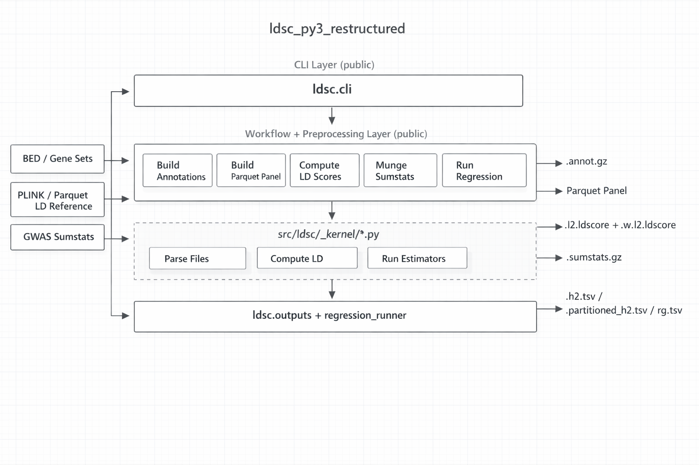

# Architecture 

`ldsc_py3_Jerry` is the refactored Python 3 LDSC package. It reads optional SNP-level annotations, PLINK or parquet R2 references, and GWAS summary statistics; resolves user-facing path and header conventions in the public workflow layer; delegates numerical work to `ldsc._kernel`; and writes LDSC-compatible artifacts that can be chained into later runs.

Related docs:

- [data-flow.md](data-flow.md): user-visible file streams and flowcharts
- [class-and-features.md](class-and-features.md): public API surface and major types
- [code-structure.md](code-structure.md): module map and change guide
- [workflow-logging.md](workflow-logging.md): per-run log naming, preflight, and API boundaries
- [liftover-harmonization-decisions.md](liftover-harmonization-decisions.md): current liftover contracts and follow-up handoff prompt
- [partitioned-h2-results.md](partitioned-h2-results.md): partitioned-h2 result columns and interpretation
- [layer-structure.md](layer-structure.md): layer-by-function object matrix
- [../../design_map.md](../../design_map.md): mapping from design docs to implementation modules



## Bird's-Eye View

- **Build query annotations**: project BED intervals onto a baseline SNP grid. Entry points: `ldsc annotate`, `ldsc.AnnotationBuilder`
- **Build parquet reference panels**: convert PLINK genotype panels into standard parquet R2 artifacts. Entry points: `ldsc build-ref-panel`, `ldsc.ReferencePanelBuilder`
- **Compute LD scores**: align annotations to a reference panel and emit LDSC-compatible LD-score artifacts; ordinary unpartitioned runs may omit annotations and receive a synthetic all-ones `base` annotation. Entry points: `ldsc ldscore`, `ldsc.run_ldscore()`, `ldsc.LDScoreCalculator`
- **Munge raw summary statistics**: normalize raw GWAS tables into curated Parquet-first sumstats artifacts, with optional legacy `.sumstats.gz` output. Entry points: `ldsc munge-sumstats`, `ldsc.SumstatsMunger`
- **Run LDSC regression**: consume munged sumstats and LD-score artifacts to estimate `h2`, partitioned `h2`, or `rg`. Entry points: `ldsc h2`, `ldsc partitioned-h2`, `ldsc rg`, `ldsc.RegressionRunner`
- **Audit workflow runs**: artifact-writing workflow wrappers create deterministic
  per-run logs after output preflight. Logs are audit artifacts and are not
  included in result `output_paths`.

## Layer Structure

- **CLI Layer**: public command dispatch in `ldsc.cli`
- **Workflow And Preprocessing Layer**: public services in `ldsc.annotation_builder`, `ldsc.ref_panel_builder`, `ldsc.ldscore_calculator`, `ldsc.sumstats_munger`, and `ldsc.regression_runner`, plus shared normalization in `ldsc.config`, `ldsc.path_resolution`, `ldsc.column_inference`, `ldsc.chromosome_inference`, and `ldsc.genome_build_inference`
- **Compute Kernel**: private file-format and numerical code in `ldsc._kernel.*`
- **Output Layer**: canonical LD-score, partitioned-h2, and rg artifact writing
  in `ldsc.outputs`, plus the fixed h2 summary writer in
  `ldsc.regression_runner`

## File Tree

```text
ldsc_py3_Jerry/
├── docs/
│   ├── current/
│   │   ├── architecture.md      # package-level architecture
│   │   ├── class-and-features.md
│   │   ├── code-structure.md
│   │   └── data-flow.md         # workflow-level file streams
│   └── assets/
├── src/ldsc/
│   ├── __init__.py          # public Python exports
│   ├── __main__.py          # `python -m ldsc` entry point
│   ├── cli.py               # unified `ldsc` command
│   ├── config.py            # validated public config dataclasses
│   ├── _logging.py          # workflow log context and LDSC logger control
│   ├── path_resolution.py   # input-token normalization and discovery
│   ├── column_inference.py  # header and identifier normalization
│   ├── chromosome_inference.py
│   ├── genome_build_inference.py
│   ├── annotation_builder.py
│   ├── ref_panel_builder.py
│   ├── ldscore_calculator.py
│   ├── sumstats_munger.py
│   ├── regression_runner.py
│   ├── outputs.py           # LD-score and partitioned-h2 artifact writers
│   └── _kernel/
│       ├── annotation.py    # low-level annotation table/BED helpers
│       ├── ref_panel_builder.py
│       ├── ref_panel.py
│       ├── ldscore.py
│       ├── sumstats_munger.py
│       ├── snp_identity.py # shared SNP identity and restriction policy
│       ├── regression.py
│       ├── _jackknife.py
│       ├── _irwls.py
│       ├── formats.py
│       └── identifiers.py
├── tests/                   # workflow and parity checks
└── tutorials/               # end-to-end usage examples
```

## Code Map

### `ldsc.cli`

This is the only command-line entry point. It parses subcommands, preserves the user-facing CLI contract, and hands control to the public workflow modules. Architecture invariant: CLI code should dispatch only; it should not contain numerical logic.

### `ldsc.config`, `ldsc.path_resolution`, `ldsc.column_inference`, `ldsc.chromosome_inference`, `ldsc.genome_build_inference`

These modules define the package-wide contracts that every workflow shares. They normalize path tokens, chromosome ordering, genome-build aliases, exact SNP identifier modes, input header aliases, and `chr_pos`-family genome-build inference before the kernel is called. `ldsc.path_resolution` also owns output-directory creation, fixed-artifact collision preflight, coherent artifact-family preflight, and stale owned-sibling cleanup helpers. `ldsc.genome_build_inference` is public for Python callers through the top-level `ldsc` exports, while the CLI exposes it only through `--genome-build auto` on existing workflows. Architecture invariant: path discovery, header inference, output preflight, and user-facing build inference happen here or in the workflow layer, never inside `_kernel`.

### `ldsc._logging`

This module owns the small shared logging context used by workflow wrappers.
It sets the LDSC logger threshold, attaches a per-run file handler to the
`LDSC` ancestor logger, writes lifecycle audit lines, restores logger state on
exit, and exposes log-only formatting helpers. Architecture invariant:
workflows preflight the log path with scientific outputs before entering the
context, and result `output_paths` mappings do not include logs.

### `ldsc.annotation_builder`

This is the public interface and workflow implementation for annotation loading and BED projection. It owns `AnnotationBuilder`, `AnnotationBundle`, `run_bed_to_annot()`, `run_annotate_from_args()`, `main()`, parser construction, path-token resolution, genome-build inference for `--genome-build auto`, annotation identity cleanup, output preflight, `annotate.log`, `dropped_snps/dropped.tsv.gz`, and `query.<chrom>.annot.gz` writing. It delegates only low-level text-table and BED intersection primitives to `ldsc._kernel.annotation`. Public interface: users should start here rather than importing the kernel directly.

### `ldsc.ref_panel_builder`

This module builds standard parquet R2 reference artifacts from PLINK inputs. It handles optional genetic-map loading, optional chain-file or HM3 quick liftover selection, explicit or packaged HM3 restriction filtering, liftover-stage drop audit sidecars, output-path construction, and `build-ref-panel.log`, then delegates pairwise-R2 emission to the kernel. PLINK source build is explicit or inferred locally; a matching chain or HM3 quick liftover emits the opposite build only in `chr_pos`-family modes, while `rsid`-family builds are source-build-only. Coordinate duplicate handling is `chr_pos`-family behavior and always uses drop-all for source/target collision groups; processed chromosomes always write `dropped_snps/chr{chrom}_dropped.tsv.gz`, header-only when no liftover-stage rows dropped. Architecture invariant: emitted parquet schemas are part of the public file contract for parquet-backed LDSC workflows.

### `ldsc.ldscore_calculator`

This module orchestrates chromosome-wise LD-score computation. It resolves annotation and reference-panel inputs, synthesizes the all-ones `base` annotation when an unpartitioned run omits baseline/query inputs, builds per-chromosome runs, aggregates them into `LDScoreResult`, routes artifact writing through `ldsc.outputs`, and writes `ldscore.log` for parsed workflow runs. The canonical parquet backend sizes a decoded row-group cache once per chromosome from the actual LD-window sequence and `snp_batch_size`; cache hits only avoid parquet rereads and never define whether a pair exists. Architecture invariant: computation stays chromosome-wise; the aggregate result is assembled only after all chromosome runs finish.

### `ldsc.sumstats_munger`

This module wraps the historical munging behavior in typed public objects such as `MungeConfig`, `RawSumstatsInference`, `SumstatsTable`, and `SumstatsMunger`. Raw heterogeneous GWAS input is named explicitly as `raw_sumstats_file` in Python and `--raw-sumstats-file` in the CLI. `main()` parses only, `run_munge_sumstats_from_args()` maps CLI arguments into `MungeConfig`, and `SumstatsMunger.run()` owns path resolution, raw-format inference, fixed-output preflight, `sumstats.log`, thin metadata sidecars, always-written `dropped_snps/dropped.tsv.gz`, and result construction before delegating primitive munging work to the kernel. `--format auto` is the default and detects common plain text, old DANER, new DANER, and PGC VCF-style headers; `--infer-only` prints the inference report and suggested minimal command without requiring `--output-dir` or writing artifacts. The workflow keeps raw-input parsing flexible, skips leading `##` raw metadata lines, writes canonical `CHR` and `POS` columns alongside `SNP`, `Z`, and `N`, loads a headered `sumstats_snps_file` keep-list or packaged HM3 restriction once before parsing, applies that restriction inside each retained chunk through shared identifier readers, and can liftover `CHR`/`POS` after filtering when a `chr_pos`-family mode and a target build plus method are supplied. In `chr_pos`-family modes, chunk filtering uses source-build coordinates and compact packed coordinate keys. HM3 quick liftover requires the packaged HM3 restriction flag. Liftover preserves `SNP` labels, drops missing or invalid coordinates before mapping, drops duplicate source-coordinate groups before mapping, drops unmapped/cross-chromosome rows, and removes duplicate target-coordinate groups after mapping. Metadata sidecars persist only `schema_version`, `artifact_type`, `snp_identifier`, `genome_build`, and optional `trait_name`; row-level identity and liftover drops are audited in `dropped_snps/dropped.tsv.gz`; detailed coordinate provenance, liftover reports, HM3 provenance, output files, and row-group layout are readable audit log entries. DANER-specific schema handling can be inferred or requested explicitly: old DANER reads case/control sample sizes from `FRQ_A_<Ncas>` and `FRQ_U_<Ncon>` headers, while new DANER reads per-SNP case/control counts from `Nca` and `Nco` columns. `MungeRunSummary.output_paths` lists curated data artifacts and the dropped-SNP audit sidecar, not `sumstats.log`. Public interface: downstream workflows should consume `SumstatsTable` or curated `sumstats.parquet`/`.sumstats.gz` plus its metadata sidecar, not raw heterogeneous GWAS tables.

### `ldsc.regression_runner`

This module rebuilds an `LDScoreResult` from on-disk artifacts, merges it with munged sumstats, drops zero-variance LD-score columns, writes per-command logs when `output_dir` is supplied, and dispatches to the regression kernel for `h2`, partitioned `h2`, and `rg`. Regression merges by the effective key for the active mode: `SNP` in `rsid`, `SNP:<allele_set>` in `rsid_allele_aware`, `CHR:POS` in `chr_pos`, and `CHR:POS:<allele_set>` in `chr_pos_allele_aware`. Regression labels traits from explicit CLI overrides, then `sumstats.metadata.json`, then filenames; rg anchor selection uses `--anchor-trait`, matching trait labels before source paths. Partitioned-h2 requires non-empty query LD-score columns and assembles one baseline-plus-query model per query annotation into the compact public schema, with optional full per-query category tables for the output writer. `--allow-identity-downgrade` is regression-only and permits same-family allele-aware/base mixes to run under the base mode; rsID-family and coordinate-family modes never mix. Architecture invariant: regression only consumes aggregated LD-score artifacts; it does not recompute LD scores.

### `ldsc.outputs`

This is the canonical LD-score and partitioned-h2 result writer. For LD-score
results it owns fixed files inside `output_dir`: `manifest.json`,
`ldscore.baseline.parquet`, and optional `ldscore.query.parquet`. The parquet files stay flat
for compatibility, but are written with one row group per chromosome;
`manifest.json` records row-group layout and per-chromosome offsets for
chromosome-scoped reads. For partitioned-h2, it owns compact
`partitioned_h2.tsv` plus the optional `query_annotations/` tree containing
`manifest.tsv`, per-query `partitioned_h2.tsv`,
`partitioned_h2_full.tsv`, and `metadata.json`. For rg, it owns `rg.tsv`,
`rg_full.tsv`, `h2_per_trait.tsv`, and the optional `pairs/` detail tree. It
reuses existing directories but refuses existing canonical files unless
overwrite is supplied. Architecture invariant: public output customization
chooses the directory name and explicit overwrite policy, not per-run filename
prefixes.

### `ldsc._kernel.*`

The kernel layer contains the actual numerical methods and low-level readers. It includes annotation table/BED primitives, PLINK/parquet reference-panel access, LD-score math, legacy-compatible summary-statistics munging, and regression estimators. Private boundary: `_kernel` is not the supported import surface and should receive only resolved primitive inputs.

## Cross-Cutting Concerns

- **Input token language**: public inputs accept exact paths, globs, and `@`
  chromosome suites. Bare prefixes without `@` are intentionally unsupported.
  Output paths are normalized but remain literal destinations.
- **Column and identifier normalization**: `column_inference.py` is the single source of truth for raw-input aliases, including `#CHROM`/`CHROM` as `CHR`, internal artifact headers, SNP identifier modes, and genome-build aliases. The sumstats workflow owns higher-level raw-format inference and conservative repair suggestions before the kernel runs. `A1` means the allele that the signed statistic is relative to, not necessarily the genome reference allele; `NEFF` is not inferred as `N`. `genome_build_inference.py` owns automatic hg19/hg38 and 0-based/1-based inference for `chr_pos` tables.
- **SNP identity policy**: public `snp_identifier` values are exactly `rsid`, `rsid_allele_aware`, `chr_pos`, and `chr_pos_allele_aware`; the default is `chr_pos_allele_aware`. Mode names are exact, while column aliases such as `RSID`, `BP`, and `POSITION` apply only to input headers. Base modes are fully allele-blind: `rsid` uses only `SNP`, and `chr_pos` uses only `CHR:POS`; allele columns may be preserved as passive data but never affect base-mode identity, duplicate filtering, retention, or drop reasons. Allele-free munging is selected through a base identifier mode, not through a separate skip flag. Allele-aware modes require usable `A1/A2` for sumstats, reference-panel artifacts, R2 parquet endpoints, and LD-score artifacts; they drop missing, invalid/non-SNP, identical, strand-ambiguous allele pairs, package-wide multi-allelic base-key clusters, and duplicate effective-key clusters. For artifact-like tables, the duplicate policy is always compute the active effective merge key, then drop all rows in duplicate-key clusters.
- **Restrictions and annotations**: restriction files may omit alleles. Allele-free restrictions, including packaged HM3 restrictions, match by base key and can retain multiple candidate rows before later artifact cleanup. Allele-bearing restrictions in allele-aware modes match by the effective allele-aware key. Restriction files are identity-only filters: duplicate restriction keys collapse to one retained key, and non-identity columns such as `CM`, `MAF`, or other metadata are not carried into downstream artifacts. Annotation files may omit alleles even in allele-aware modes because annotations describe genomic membership, not variant alleles; if annotation files include alleles, those alleles participate in allele-aware matching.
- **Artifact compatibility**: Public downstream chaining uses `.annot.gz`, Parquet-first munged sumstats with optional `.sumstats.gz` compatibility output and `sumstats.metadata.json`, and canonical LD-score result directories. The forward format rule is parquet for internal artifacts and TSV for science-facing result tables. LD-score and sumstats parquet payloads use chromosome-aligned row groups where useful, so full-file readers still work while chromosome-specific readers can skip unrelated row groups. Legacy `.l2.ldscore(.gz)`, `.l2.M`, `.l2.M_5_50`, and separate `.w.l2.ldscore(.gz)` files remain internal/legacy file-format concerns, not the public LD-score writer contract.
- **Output collision handling**: output directories are literal destinations.
  Missing directories are created, existing directories are reused, and fixed
  output files, including workflow logs, are checked before writing. By
  default an existing artifact raises `FileExistsError`; `--overwrite` or
  `overwrite=True` makes replacement explicit without deleting unrelated files
  or cleaning the directory.
- **Workflow logging**: `ldsc._logging.workflow_logging()` attaches file
  handlers to the `LDSC` logger so workflow and kernel records are captured
  together. Logs are audit files, not scientific outputs, so result
  `output_paths` mappings exclude them. Lifecycle sections use a multi-line
  `Call:` block, separated `Inputs:`/`Outputs:` audit blocks, and an explicit
  elapsed-time footer such as `Elapsed time: 2.0min:12s`.
- **Dependency split**: base package dependencies cover core pandas/numpy/SciPy
  workflows and parquet I/O. PLINK-backed LD computation requires the
  `plink` extra (`bitarray`), BED projection requires the `bed` extra
  (`pybedtools` plus the external `bedtools` executable), and cross-build
  reference-panel output requires the `liftover` extra (`pyliftover`).
- **Chromosome ordering**: chromosome-sharded inputs are validated and reassembled in stable genomic order by the workflow layer.
- **Testing approach**: tests under `tests/` cover file contracts, workflow behavior, and legacy compatibility expectations.

## Architectural Invariants

- Import from `ldsc`, not from `ldsc._kernel`, for supported public use.
- Kernel code must not resolve globs, `@` suites, or other user-facing path tokens.
- `column_inference.py` owns alias families and internal artifact header strictness.
- LD-score computation remains chromosome-wise; regression consumes only the aggregated artifacts.
- Public LD-score output layout is fixed by `LDScoreDirectoryWriter`;
  partitioned-h2 result tables use fixed compact/full schemas owned by
  `PartitionedH2DirectoryWriter`.
- New internal or intermediate artifacts should be parquet by default; new
  science-facing result tables should be TSV. Compatibility text outputs must
  be called out as legacy or sidecar exceptions.
- Query annotations are valid only with explicit baseline annotations; the
  synthetic `base` path is for ordinary unpartitioned LD-score generation and
  downstream `h2`/`rg`, not for `partitioned-h2`.
- Every workflow that writes fixed artifacts must precompute expected output
  paths, including its log path, and call the shared output preflight before
  the first write.
