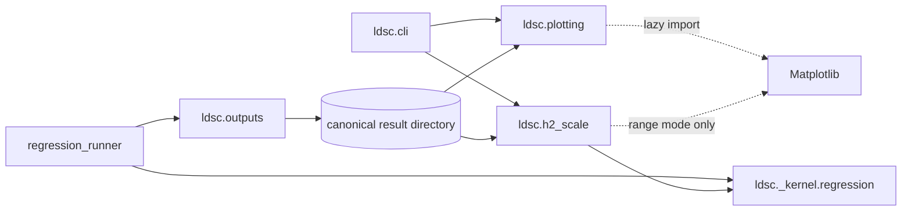

# Plotting and Heritability-Scale Post-processing

Last updated on: 2026-09-08

This document is the developer-facing contract for the plotting layer and the post-fit observed-to-liability-scale conversion workflow. For scientist-facing commands and interpretation, see [the plotting results manual](../../tutorials/plotting-results.md).

## Scope

The integration adds two public workflows without coupling figure generation to regression:

- `ldsc plot --result-dir RESULT_DIR` selects one approved plot from canonical result metadata.
- `ldsc convert-h2-scale --h2-result-dir H2_RESULT ...` converts a saved observed-scale h2 estimate at one population prevalence or over a prevalence range.

Core workflows never generate plots automatically. Matplotlib is a required package dependency, Seaborn is not used, and ordinary package imports and numerical commands do not import the plotting runtime.

## Package boundaries



| Module | Responsibility |
| --- | --- |
| `ldsc.cli` | Parse and dispatch the two commands; define no plotting or conversion math. |
| `ldsc.plotting` | Validate canonical metadata, select one plot contract, manage plot-family output, and expose `PlotArtifact`. |
| `ldsc.plotting._builders` | Private Matplotlib-only builders and visual validation. Imports Matplotlib and selects the noninteractive `Agg` backend. |
| `ldsc.h2_scale` | Load a canonical h2 result, call the kernel conversion factor, write the derived table/metadata/log, and build the range plot when requested. |
| `ldsc.regression_runner` | Compute the exact h2 regression-bin diagnostic from the final fitted SNP population. |
| `ldsc.outputs` | Validate and write the h2 bin table and define core ownership of nested derived roots. |
| `ldsc._logging` | Add `RUN_FAILED` marker behavior around authorized overwrites without changing workflow action order. |

The public Python surface lazily exports `plot_result`, `PlotArtifact`, `convert_h2_scale`, and `H2ScaleConversionArtifact` from `ldsc.__init__`. Accessing a lazy plotting export does not itself import Matplotlib; the dependency is loaded only when a figure must be built.

## Public interfaces

```text
ldsc plot --result-dir RESULT_DIR [--overwrite] [--log-level LEVEL]

ldsc convert-h2-scale \
  --h2-result-dir H2_RESULT \
  --samp-prev P \
  (--pop-prev K | --pop-prev-range MIN MAX) \
  [--num-points N] [--overwrite] [--log-level LEVEL]
```

Neither CLI command accepts `--output-dir`. Their fixed destinations are derived from their source result. The Python functions use the same destinations by default and expose `output_dir=` only as an advanced unmanaged override:

```python
from ldsc import convert_h2_scale, plot_result

plot = plot_result("results/h2", output_dir="scratch/custom-plot")
conversion = convert_h2_scale(
    "results/h2",
    samp_prev=0.5,
    pop_prev_range=(0.01, 0.20),
    output_dir="scratch/custom-conversion",
)
```

A core overwrite can remove only the package-owned default nested roots; it cannot discover or clean a Python override elsewhere.

## Metadata-driven plot dispatch

`plot_result` requires `<result-dir>/diagnostics/metadata.json`, checks only plotting-relevant fields, and then loads the file declared under `metadata["files"]`. It deliberately does not check `schema_version` and never infers a result type from filenames or table shape.

| Source result root | Required metadata | Declared source | Plot kind and fixed filename |
| --- | --- | --- | --- |
| `h2` | `artifact_type=h2_result`; `files.ld_score_regression_bins` | `diagnostics/ld_score_regression_bins.tsv` | `ld_score_regression`; `ld_score_regression.png` |
| all-pairs `rg` | `artifact_type=rg_result`; `pair_kind=all_pairs`; `trait_names`; `files.rg` | `rg.tsv` | `rg_heatmap`; `rg_heatmap.png` |
| anchor `rg` | `artifact_type=rg_result`; `pair_kind=anchor`; `trait_names`; `files.rg` | `rg.tsv` | `rg_anchor_forest`; `rg_anchor_forest.png` |
| functional `partitioned-h2` | `artifact_type=partitioned_h2_result`; `analysis_type=functional_category`; `headline_metric=enrichment`; `files.summary` | `partitioned_h2.tsv` | `functional_h2_enrichment`; `functional_h2_enrichment.png` |
| query/cell-type `partitioned-h2` | `artifact_type=partitioned_h2_result`; `analysis_type=cell_type_specific`; `headline_metric=coefficient`; `files.summary` | root `partitioned_h2.tsv` | `cell_type_query_pvalues`; `cell_type_query_pvalues.png` |
| `quantile-h2` | `artifact_type=quantile_h2_result`; `target_annotation`; `files.quantile_h2` | `quantile_h2.tsv` | `continuous_annotation_quantile_enrichment`; `continuous_annotation_quantile_enrichment.png` |

The cell-type input is the aggregate `partitioned-h2` root. A per-query `diagnostics/query_annotations/<query>/` directory is rejected because it represents one baseline-plus-query fit rather than the suite-level comparison.

Each builder validates its required table columns and value domains. Missing or failed rg/query values remain explicit in the figure. The dispatcher rejects raw LDSC2 outputs, loose tables, unsupported analysis regimes, absolute or escaping metadata paths, duplicate rg pairs, and incomplete artifacts.

## Exact h2 regression-bin diagnostic

Every new unpartitioned h2 run writes `diagnostics/ld_score_regression_bins.tsv`, independent of Matplotlib. The table is computed from the exact SNP population entering the final slope fit after the active chi-square filter. In two-step estimation, it therefore uses the second-step slope population rather than only the first-step intercept subset.

The helper stably sorts the one retained unpartitioned LD Score and divides rows into `min(50, n_snps)` nonempty, nearly equal-count rank bins. Stable sorting preserves fitted row order within tied LD Scores. The fixed columns are:

```text
bin
n_snps
ld_score_min
ld_score_max
mean_ld_score
mean_chi_square
sd_chi_square
mean_sample_size
mean_fitted_chi_square
mean_regression_weight
```

Per-SNP fitted chi-square values use the final fitted intercept and slope together with each SNP's exact sample size and LD Score. Regression weights come from the estimator's existing `Hsq.weights` function evaluated on the final model inputs. Aggregation is diagnostic calculation, not a second fit. Old h2 results without the table hard-fail with rerun guidance.

## Liability-scale conversion contract

`convert_h2_scale` requires one canonical `h2_result`, follows `files.summary`, and loads exactly one row containing `trait_name`, `total_h2_obs`, and `total_h2_obs_se`. It never uses already-populated liability fields as source values.

The workflow calls `ldsc._kernel.regression.liability_conversion_factor`; it does not duplicate the formula. The estimate and block-jackknife SE are multiplied by the same factor. Population prevalence is treated as fixed, so prevalence uncertainty is not propagated.

- Exact mode accepts one `pop_prev`, writes one row, and never imports Matplotlib.
- Sensitivity mode accepts an inclusive `(MIN, MAX)` range, uses `num_points=201` by default, and writes one linearly spaced row per prevalence plus a figure.
- Existing `h2` and `partitioned-h2` exact-K shortcuts continue to accept one `--samp-prev`/`--pop-prev` pair. `rg` continues to accept one pair per input trait.

## Output families and ownership

Default plot output:

```text
<result-dir>/plots/
  <fixed-figure-name>.png
  diagnostics/
    metadata.json
    plot.log
```

Default conversion output:

```text
<h2-result-dir>/postprocessing/liability-scale/
  h2_scale_conversion.tsv
  h2_prevalence_sensitivity.png        # sensitivity mode only
  diagnostics/
    metadata.json
    convert-h2-scale.log
```

An existing directory is allowed; only owned fixed artifacts collide. Without overwrite, the workflow lists conflicting paths and writes nothing. With overwrite, `plot` replaces only its selected PNG, metadata, and log. A sensitivity conversion owns the table, plot, metadata, and log. An exact conversion writes the table, metadata, and log and removes a stale sensitivity plot after successful publication.

The default `plots/` root is owned by h2, partitioned-h2, quantile-h2, and rg. The default `postprocessing/` root is owned by h2. A successful core overwrite publishes its normal current artifacts in the pre-existing order and then removes stale derived roots. An orphaned derived root is therefore also a no-overwrite collision. Unrelated files elsewhere in the result directory remain untouched.

## Failed-overwrite visibility

Every public materializing CLI or corresponding high-level Python workflow uses the marker helper in `ldsc._logging`. A failed attempt with overwrite authorization writes a plain-text marker in the applicable output scope:

- ordinary workflows: `<output-dir>/RUN_FAILED.txt`
- plotting: `<result-dir>/plots/RUN_FAILED.txt`
- conversion: `<h2-result-dir>/postprocessing/liability-scale/RUN_FAILED.txt`
- concrete reference-panel chromosome: `<output-dir>/RUN_FAILED.chr<chrom>.txt`

The marker reports the command/API boundary, UTC timestamp, exception, detailed log path when one opened, and that the directory may contain incomplete or mixed artifacts. Marker handling adds no quarantine, rollback, restoration, or action-order change. If a workflow opened its normal log before failing, that log remains with its ordinary failure footer and traceback; artifacts already written by the existing workflow order also remain. A successful materializing retry removes the applicable marker after normal success. A no-overwrite collision creates no marker.

## Required dependency and headless behavior

`setup.py` includes Matplotlib in `install_requires`; there is no plotting extra or opt-out installation mode. A normal LDSC installation therefore fails if pip cannot install a compatible Matplotlib. `_builders.py` selects `Agg` before importing `matplotlib.pyplot`, so commands work on SLURM and other display-free systems. Lazy imports remain an execution-isolation boundary: ordinary imports and numerical commands do not initialize Matplotlib, exact conversion does not import it, and a damaged environment missing the required dependency produces actionable repair guidance only when a figure-producing path is invoked.

## Deterministic visual examples

`tools/generate_plot_examples.py` creates small canonical source-result trees and all seven approved figures. Run it with a new destination in a normal package environment:

```bash
python tools/generate_plot_examples.py /tmp/ldsc-plot-examples
```

The script is a developer review aid, not a runtime dependency or an additional public plotting interface. It exercises the same `plot_result` and `convert_h2_scale` paths used by package consumers.

## Extending the plot suite

Keep the public surface as one dispatcher. A new plot requires all of the following:

1. A distinct scientific question that is not redundant with an existing plot.
2. A canonical source artifact containing every plotted quantity; plotting may not refit or approximate it.
3. A metadata predicate and declared `files` key in `_select_contract`.
4. A private builder with strict table validation, explicit uncertainty semantics, and headless behavior.
5. A fixed filename, artifact/lifecycle tests, numerical artist tests, dependency-isolation coverage, user interpretation documentation, and a rendered visual review.

Do not add automatic plotting, plot-type CLI switches, arbitrary styling flags, multiple-testing correction, or an additional plotting dependency without a new design decision.
